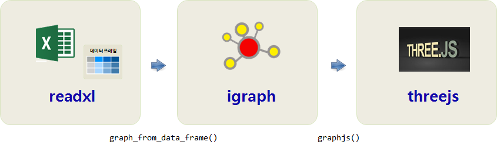

 
``` {r, include=FALSE}
source("tools/chunk-options.R")
knitr::opts_chunk$set(echo = TRUE, warning=FALSE, message=FALSE, fig.width=12, fig.height=12)

library(igraph)
library(tidyverse)
library(threejs)
library(readxl)
library(ggpubr)
library(forcats)
library(extrafont)
loadfonts()

```

## 1. 메르스 사태 [^mers-kbs] {#mers-news}

[^mers-kbs]: [데이터저널리즘, 메르스 사태를 한눈에_KBS 성재호 기자](http://reportplus.kr/?p=15034)

[메르스, 중동호흡기증후군](https://ko.wikipedia.org/wiki/%EC%A4%91%EB%8F%99%ED%98%B8%ED%9D%A1%EA%B8%B0%EC%A6%9D%ED%9B%84%EA%B5%B0)은 
2015년 5월 21일 사우디아라비아 등을 거쳐 바레인을 방문한 68세 남성이 첫 확진 진단은 이후 크나큰 사회문제와 함께 향후 숙제를 남겨주었다.

## 2. 메르스 네트워크 분석 {#mers-network-analysis}

[NetMiner - MERS-CoV](http://www.netminer.com/community/event/event-readList.do) 웹사이트에 일자별로 데이터가 잘 정리되어 있다.
국문과 영문으로 두가지 언어로 제공되고 있으며 엑셀 파일을 메르스 네트워크 분석 데이터로 활용한다.

### 2.1. 메르스 데이터 환경설정 {#mers-network-configuration}

네트워크 분석을 위해서 필요한 데이터분석 연장을 준비한다.
데이터프레임으로 네트워크 분석에 필요한 데이터를 가져와서 `graph_from_data_frame()` 함수를 통해 `igraph` 객체로 변환하여 
정적, 동적 네트워크 및 다양한 통계분석을 수행한다. 단, 데이터는 결점(Vertex, Node), 연결점(Edge, Link) 정보를 담고 있는
`edgelist` 형태로 자료구조를 사전에 정비해야만 된다.



``` {r mers-network-pkg,eval=FALSE}
# 0. 환경설정 ------------------

library(igraph)
library(tidyverse)
library(threejs)
library(readxl)
library(ggpubr)
library(forcats)
library(extrafont)
loadfonts()
```

### 2.2. 메르스 데이터 {#mers-network-data}

[NetMiner - MERS-CoV](http://www.netminer.com/community/event/event-readList.do)에서 다운로드 받은 엑셀 파일에서 필요한 결점(Vertex, Node), 연결점(Edge, Link) 쉬트를 
`read_excel` 함수를 통해 불러온다.

- 결점(Vertex): (한국어)2015-10-02xlsx.xlsx", sheet="확진자"
- 연결선(Edge): (한국어)2015-10-02xlsx.xlsx", sheet="확진자간 link"

그리고 나서 `graph_from_data_frame()` 함수를 통해 `igraph` 네트워크 객체를 생성하면 데이터 준비는 모두 끝났다.

``` {r mers-network-data}
# 1. 데이터 가져오기 ------
## 1.1. 데이터 읽어들이기
mers_vert <- read_excel("data/(한국어)2015-10-02xlsx.xlsx", sheet="확진자")
colnames(mers_vert) <-c("확진자", "성별", "나이", "확진일", "현상태", "현상태_판정일자", 
                        "감염병원", "감염지역", "감염 이유", "비고")

mers_edge <- read_excel("data/(한국어)2015-10-02xlsx.xlsx", sheet="확진자간 link")

## 1.2. 네트워크 데이터 변환
mers_ng <- graph_from_data_frame(d = mers_edge, vertices = mers_vert, directed = TRUE)
```

## 3. 메르스 데이터 분석 헬로우 월드 {#mers-network-hello-world}

결점(Vertex)에서 성별을 뽑아 색상을 달리 한 후에 메르스 igraph 객체를 시각화해보자.

``` {r mers-network-helloworld}
# 2. 네트워크 데이터 변환 ------

V(mers_ng)$color <- ifelse(V(mers_ng)$성별 == "f", "red", "blue")


# 3. 네트워크 데이터 변환 ------
plot(mers_ng,
     vertex.label.color = "black",
     vertex.label.cex = 0.8,
     vertex.size = 0,
     edge.color = 'black',
     edge.width = 1,
     edge.arrow.size = 0.1,
     layout = layout_nicely(mers_ng))
```

### 3.1. 메르스 데이터 탐색적 데이터 분석  {#mers-network-EDA}

메르스 감염 네트워크를 이해하기 필요한 기본적인 정보를 살펴본다.
먼저 네트워크 내 결점(Vertex, Node)와 연결선(Edge, Link) 갯수를 살펴본다.
`vcount`, `ecount`도 있고, `gorder`, `gsize` 함수도 있지만 동일하다.

그리고, `farthest_vertices`, `get_diameter` 함수를 통해 네트워크 노드간 떨어진 거리도 파악한다.

``` {r mers-network-eda}
# 2. 네트워크 기술통계 ------
## 2.1. 결점(Vertex, Node)와 연결선(Edge, Link) 갯수
vcount(mers_ng)
gorder(mers_ng)

gsize(mers_ng)
ecount(mers_ng)

## 2.2. 네트워크 크기

farthest_vertices(mers_ng) 
get_diameter(mers_ng)  
```

### 3.2. 특정 결점(vertex) 기준 {#mers-network-vertex}

메르스 데이터는 양방향이 아니라 특정 환자가 다른 환자를 감염시키는 구조라 `mode`는 `out`만 의미가 있다. 

- `ego()` 함수를 통해 특정 결점(vertex), 'M00014' 환자와 떨어진 정도(`2`)를 지정하면 근처 결점을 확인할 수 있다.
- `incident()` 함수는 특정 결점과 연결된 연결선을 확인하는데 도움을 준다.


``` {r mers-network-eda-node-edge}
ego(mers_ng, 2, 'M00014', mode = c('out'))
incident(mers_ng, 'M00014', mode = c("all"))
```

### 3.3. 교차 결점(vertex) 파악 {#mers-network-vertex-intersection}

메르스 전파에서 중요한 역할을 한 'M00014' 환자와 'M00001' 환자 사이에 어떤 환자가 있는지 파악하는데 `neighbors()` 함수로 
특정 네트워크를 떼어내고 나서, `intersection()` 함수를 사용하게 되면 중간 매개환자도 쉽게 파악할 수 있다.

``` {r mers-network-vertex-intersection}
## 2.3. 교차 결점
mers_14 <- neighbors(mers_ng, 'M00014', mode = c('all'))
mers_01 <- neighbors(mers_ng, 'M00001', mode = c('all'))

intersection(mers_14, mers_01)
```

## 4. 메르스 중요환자(Vertex) 식별 {#mers-network-important-vertex}

네트워크가 크면 중요 결점(vertex)를 시각적으로 식별하는 것이 쉽지는 않다.
이런 경우 `degree()` 함수를 사용해서 **나가는 도수(Out Degree)**를 통계량으로 설정하여 
일반적인 결점과 중요한 결점을 파악한다.

``` {r mers-network-vertex-degree}
# 3. 핵심 결점(vertex) 식별 ------
## 3.1. 나가는 도수(Out Degree) 기준 중요 결점 식별
mers_outd <- degree(mers_ng, mode = c("out"))
table(mers_outd)
which.max(mers_outd)

## 3.2. 나가는 도수 히스토그램
mers_outd_df <- data.frame(mers_outd)
mers_outd_df$mers_id <- row.names(mers_outd_df)

mers_outd_df %>% 
  rename(연결중앙성 = mers_outd) %>% 
  ggplot(aes(x=연결중앙성)) +
    geom_density() +
    labs(x="외부로 나가는 연결중앙성", y="밀도") +
    theme_pubr(base_family = "NanumGothic")
```

### 4.1. 메르스 중요환자(Vertex) 시각화 {#mers-network-important-vertex-viz}

`make_ego_graph()` 함수를 통해 특정 노드 나가는 도수가 가장 큰 값을 갖는 'M00014'를 중심으로 그래프를 생성하고 나서,
이에 대한 거리를 계산한다. 그리고 거리를 각 노드에 넣어 시각화를 완성한다.

``` {r mers-network-vertex-degree-viz}
## 3.3. 나가는 도수 거리별 시각화

M00014 <- make_ego_graph(mers_ng, diameter(mers_ng), nodes = 'M00014', mode = c("all"))[[1]]
mers_dists <- distances(M00014, "M00014")

colors <- c("black", "red", "orange", "blue")
V(M00014)$color <- colors[mers_dists+1]

plot(M00014, 
     vertex.label = mers_dists, 
     vertex.label.color = "white",
     vertex.label.cex = 1,
     edge.color = 'black',
     vertex.size = 5,
     edge.arrow.size = .05,
     main = "메르스 최초 환자로부터 거리(Geodesic Distances)")
```

### 4.2. 메르스 중요환자(Vertex) 고유값 기준 시각화 {#mers-network-important-vertex-viz-eigen}

고유값 중앙성(eigen_centrality)을 기준으로 중요 결점을 파악하고 이를 시각화하는 것도 가능하다.

``` {r mers-network-vertex-degree-eigen}
# 4. 고유값 기준 ---------------
mers_ng_ec <- eigen_centrality(mers_ng)
which.max(mers_ng_ec$vector)

plot(mers_ng,
     vertex.label.color = "black", 
     vertex.label.cex = 0.8,
     vertex.size = 20*(mers_ng_ec$vector),
     edge.color = 'gray88',
     edge.arrow.size = .05,
     main = "메르스 전파 중요 환자 - 고유값 중심점 기준"
)
```

## 5. 메르스 병원 시각화 {#mers-network-color-hospital}

네트워크 시각화에 메르스 병원을 시각화하는 경우 먼저 `V(mers_ng)$color`에 색상을 정의한다.
`fct_lump()` 함수를 사용하면 손쉽게 범주를 나눌 수 있다.


``` {r mers-network-vertex-coloring}
# 5. 병원 시각화 ------
V(mers_ng)$color <- fct_lump(V(mers_ng)$감염병원, 7)

plot(mers_ng, 
     vertex.label = V(mers_ng)$감염병원, 
     vertex.label.color = "black",
     vertex.label.cex = 0.9,
     vertex.label.family="NanumGothic",
     edge.color = 'black',
     vertex.size = 5,
     edge.arrow.size = .05,
     main = "메르스 감염병원")
```

## 6. 인터랙티브 메르스 감염 시각화 {#mers-network-interactive}

동적(static), 정적(dynamic), 인터랙티브(interactive) 네트워크 시각화 팩키지가 다수 존재한다.
R Base 그래픽 시스템에 기초한 계열과 최근 그래프 문법(grammar of graphcis)에 기초한 계열 이 정적그래프에 존재하고,
동적, 인터랙티브, 애니메이션 계열이 별도로 존재한다.

- 정적: 
    - Base 그래프: **igraph**, statnet
    - 그래프 문법(grammar of graphcis):  ggraph, ggnet, ggnetwork 등
- 동적: **threejs**, visNetwork, networkD3, visNetwork, sigma, rgexf 등

``` {r mers-network-interactive-graph}
graphjs(mers_ng,
        vertex.shape = V(mers_ng)$name,
        vertex.size = 0.1,
        edge.color = 'darkgray',
        main = "메르스 전파 네트워크"
)
```