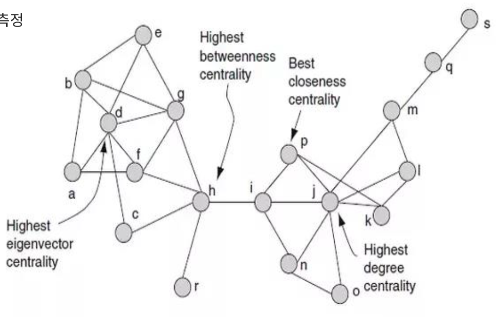
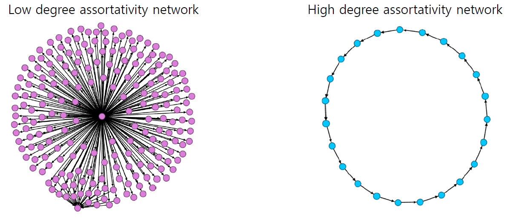

 
``` {r, include=FALSE}
source("tools/chunk-options.R")
knitr::opts_chunk$set(echo = TRUE, warning=FALSE, message=FALSE, fig.width=12, fig.height=12)

library(igraph)
library(tidyverse)
library(extrafont)
loadfonts()

```

# 네트워크 기술통계 [^network-paper] [^network-got] [^network-rfacebook] [^network-centrality] {#network-descriptive-stat}

[^network-paper]: [Duncan J. Watts & Steven H. Strogatz (1998), "Collective dynamics of ‘small-world’ networks", Nature volume 393, pages 440–442 ](https://www.nature.com/articles/30918)

[^network-got]: [Shirin Glander(2017), Network analysis of Game of Thrones, data science+](https://datascienceplus.com/network-analysis-of-game-of-thrones/)

[^network-rfacebook]: [Social network analysis with R: node and network properties](https://cdn.rawgit.com/pablobarbera/data-science-workshop/master/sna/02_networks_descriptive.html)

[^network-centrality]: [https://www.datacamp.com/community/tutorials/centrality-network-analysis-R](https://www.datacamp.com/community/tutorials/centrality-network-analysis-R)


[Duncan J. Watts & Steven H. Strogatz (1998), "Collective dynamics of ‘small-world’ networks", Nature volume 393, pages 440–442 ](https://www.nature.com/articles/30918) 논문을 통해 
배우들의 영화출연 관계, 전력선 연결, 예쁜 꼬마 선충의 뉴론 연결구조 등을 통해 다양한 분야에서 공통적으로 관찰되는 특징을 모아 네트워크 과학의 시작을 알리게 되었다.

네트워크 데이터의 분석의 시작점은 아마도 네트워크에서 중요한 역할을 하는 노드(node)/결점(vertex)을 식별하는 것이다.
네트워크 중심성(Centrality)은 결점(vertext)에서 연결선(edge)를 통해 주고받은 횟수, 중심성이 높은 네트워크는 일부 결점이 극단적으로 많은 연결을 갖는 반면
낮은 중심성은 다수 결점이 유사한 수의 연결선을 갖는 것을 나타냄.

- Degree: 직접적인 영향력을 측정하는 지표로 각 노드/결점이 다른 노드/결점과 주고받은 유일무이한 횟수가 된다.
    - `igraph::degree(g)` 함수에 `indegree`, `outdegree`, 전체 degree로 `mode="in"`, `mode="out"`, `mode="total"` 인자를 전달하여 계산한다.
- Strength: 특정 노드/결점에서 다른 노드/결점으로 가는 연결선 횟수를 고려하여 가중치를 두고 계산한 Degree.
    - `strength(g)` 함수를 사용한다.
- Closeness: 특정 노드/결점에서 다른 모든 노드/결점에 도달하는데 얼마나 많은 단계를 거치는지를 나타내는 지표. 즉, `Closeness`가 높다는 것은 네트워크 중심성이 낮다는 반증이 됨.
    - `closeness(g, normalized=TRUE)` 함수 사용.
- Betweenness: 브로커(broker)/문지기(gatekeeper) 지표. 특정 노드/결점을 관통하는 노드/결점간 최단경로수.
    - `betweenness()` 함수 사용.
- Eigenvector centrality: 높은 Degree를 갖는 노드/결점에 대한 연결수에 따라 노드/결점 점수를 부여.
    - `eigen_centrality(g)$vector` 함수 사용.
- PageRank: 입력 연결선을 많이 갖는다면 중요한 노드/결점으로 인식하는 지표.
    - `page_rank(g)$vector` 함수 사용.
- Authority score: 최초 웹에 적용된 중심성 측정 지표로 특정 노드/결점이 높은 Authority 점수를 갖는 경우는 다른 노드/결점과 연결선이 많은 다른 노드/결점에 연결되는 경우.
    - `authority_score(g)$vector` 함수 사용.


# 네트워크 특성 {#network-descriptive-stat-property}

네트워크 전체를 기술하는 기술통계량도 중요한 역할을 수행한다.
이를 위해서 `diameter()`, `get_diameter()`, `mean_distance()`, `distances()` 함수를 통해서 전체 네트워크에 대한 특성을 확정지을 수 있다.

- `diameter()`: 가장 긴 두 노드/결점 길이를 측정함.
    - `diameter(g, directed=FALSE, weights=NA)`
- `get_diameter()`: `diameter()`로 특정한 가장 긴 두 노드/결점 경로를 파악.
    - `get_diameter(g, directed=FALSE, weights=NA)`
- `mean_distance()`: 전체 네트워크의 두 노드/결점간의 평균 길이.
    - `mean_distance(g, directed=FALSE)`
- `distances()`: 각 노드/결점을 짝지어 거리를 나타냄.
    - `distances(g, weights=NA)`
- `edge_density()`: 네트워크에 존재할 수 있는 모든 가능한 연결선 대비 실제 존재하는 네트워크 연결선에 대한 비율
    - `edge_density(g)`
- `reciprocity()`: `i` 노드/결점이 `j` 노드/결점에 연결되었다면 상호간에 대등하게  `j` 노드/결점이 `i` 노드/결점에 연결되어야 하는 정도.
- `transitivity()`: 군집계수(clustering coefficient)로 알려져 있고, `i` 노드/결점이 `j` 노드/결점에 연결되었고, `j` 노드/결점이 `k` 노드/결점에 연결되었다면,
`i` 노드/결점이 `k` 노드/결점에 연결될 확률이 얼마인지 측정함.
    - transitivity(g, type = "global")


# 사례 [^lee-network] {#network-descriptive-stat-property-case-study}

[^lee-network]: [이은조 (엔씨소프트), "네트워크 분석 기법을 활용한 게임 데이터 분석"](http://ruck2018.r-kor.org/speakers/)

## 노드 중요성 {#network-descriptive-stat-property-case-study-nodes}

해당 네트워크에서 노드의 중요성을 측정하는 `degree`, `betweenness`, `closeness`, `eigenvector` 등 지표를 활용한다. [이은조 (엔씨소프트), "네트워크 분석 기법을 활용한 게임 데이터 분석"](http://ruck2018.r-kor.org/speakers/) 4번째 슬라이드에 나온 네트워크를 대상으로 각 노드별 중요도 측정 지표를 구해본다.

<div class = "row">
  <div class = "col-md-6">

```{r tidygraph}
library(tidyverse)
library(readxl)
library(igraph)

net_df <- read_excel("data/network.xlsx", sheet="Sheet1")
net <- graph_from_data_frame(net_df, directed = FALSE)

plot(net,
    vertex.color="dark gray",
    vertex.size=10)

```

  </div>
  <div class = "col-md-6">



  </div>
</div>

### `degree` 중심성(Centrality) {#network-descriptive-stat-degree}

```{r network-degree}
net_degree <- igraph::degree(net, mode = "total", normalized = TRUE)

degree_df <- net_degree %>% 
    as.data.frame() %>% 
    `colnames<-` (c("degree")) %>% 
    `rownames<-` (names(net_degree)) %>% 
    rownames_to_column(var="node") %>% 
    arrange(desc(degree))

DT::datatable(degree_df)
```

### `between` 중심성(Centrality)  {#network-descriptive-stat-between}

```{r network-between}
net_between <- igraph::betweenness(net, normalized = TRUE)

between_df <- net_between %>% 
    as.data.frame() %>% 
    `colnames<-` (c("between")) %>% 
    `rownames<-` (names(net_between)) %>% 
    rownames_to_column(var="node") %>% 
    arrange(desc(between))

DT::datatable(between_df)
```

### `closeness` 중심성(Centrality) {#network-descriptive-stat-closeness}

```{r network-closeness}
net_closeness <- igraph::closeness(net, mode = "total", normalized = TRUE)

closeness_df <- net_closeness %>% 
    as.data.frame() %>% 
    `colnames<-` (c("closeness")) %>% 
    `rownames<-` (names(net_closeness)) %>% 
    rownames_to_column(var="node") %>% 
    arrange(desc(closeness))

DT::datatable(closeness_df)
```

### `eigenvector` 중심성(Centrality)  {#network-descriptive-stat-eigenvector}

```{r network-eigen}
net_eigen <- igraph::eigen_centrality(net)$vector

eigen_df <- net_eigen %>% 
    as.data.frame() %>% 
    `colnames<-` (c("eigenvector")) %>% 
    `rownames<-` (names(net_eigen)) %>% 
    rownames_to_column(var="node") %>% 
    arrange(desc(eigenvector))

DT::datatable(eigen_df)
```


## 네트워크 구조 [^descriptive-statistics-network] {#network-descriptive-stat-property-case-study-structure}

[^descriptive-statistics-network]: [Pablo Barbera(June 27, 2017), "Social network analysis with R: Descriptive analysis"](http://pablobarbera.com/big-data-upf/html/02b-networks-descriptive-analysis.html)

### 위상구조 파악 {#network-case-study-structure-topology}

- Size
- Radius: 접근성(closeness centrality)이 가장 좋은 노드에서 가장 먼 노드까지의 거리
- transivity(Clustering Coefficient): 나의 서로 다른 두 친구가 서로 친구일 확률
- Degree Assortativity: 서로 연결된 노드쌍의 Degree 상관관계
- 노드 Degree 평균 / 표준편차
- 노드 Betweenness 평균 / 표준편차


```{r network-structure-size}
diameter(net, directed = FALSE)
get_diameter(net, directed = FALSE)
```


```{r network-structure-transitivity}
transitivity(net)
```


```{r network-structure-assortative-degree}
assortativity.degree(net)
```

 

