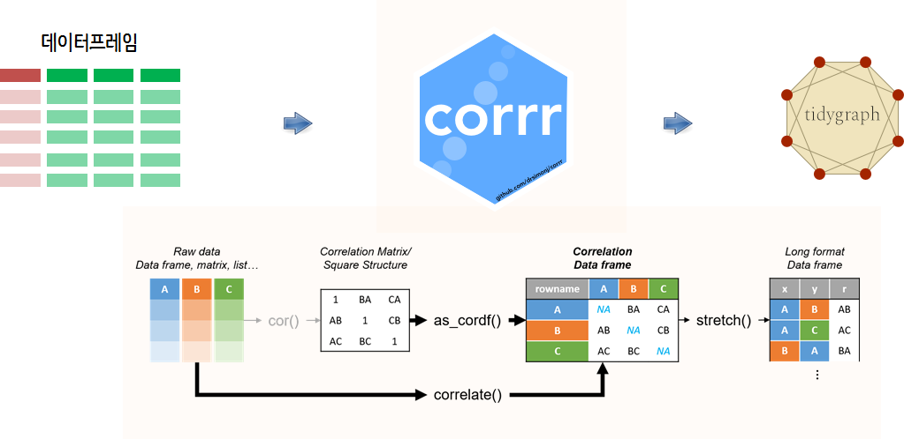

 
``` {r, include=FALSE}
source("tools/chunk-options.R")
knitr::opts_chunk$set(echo = TRUE, warning=FALSE, message=FALSE, fig.width=12, fig.height=12)

library(tidyverse)
library(rvest)
library(glue)
library(curl)
library(corrplot)
library(corrr)
library(tidygraph)
library(ggraph)
library(extrafont)
loadfonts()


seven_df <- read_rds("data/seven_df.rds")
six_df <- read_rds("data/six_df.rds")
pop_df   <- read_rds("data/pop_df.rds")


```

# 제7회 지방선거 [^correlation-tidygraph] {#local-election-data}

[^correlation-tidygraph]: [{tidygraph}と{ggraph}によるモダンなネットワーク分析](https://www.slideshare.net/kashitan/tidygraphggraph)

제7회 지방선거는 더불어민주당의 압승으로 막을 내렸고, 그 후폭풍으로 야당을 중심으로 정계개편에 대한 논의가 오고가고 있다.

## 제7회 지선 데이터 {#local-election-7th-data}

[위키백과사전 제7회_전국동시지방선거](https://ko.wikipedia.org/wiki/제7회_전국동시지방선거) 페이지에서 지방선거 데이터를 가져올 수 있다.
그리고, 유권자수를 대신하여 [위키백과 대한민국 행정구역](https://ko.wikipedia.org/wiki/대한민국의_행정_구역) 페이지에서 광역시도별 인구수를 가져올 수 있다.

데이터는 광역의원 비례대표 정당별 득표를 가져와서 이를 바탕으로 정당별 비례대표 투표수를 상관분석과 네트워크 시각화 분석 재료로 삼는다.

`rvest` 팩키지로 데이터를 가져와서 정제 작업을 수행하여 깔끔한 데이터프레임으로 저장한다.

``` {r local-election-7th-data, eval = FALSE}
# 0. 환경설정 -----
library(tidyverse)
library(rvest)
library(glue)
library(curl)
library(corrplot)
library(corrr)
library(tidygraph)
library(ggraph)
library(extrafont)
loadfonts()

# 1. 데이터 -----
# Sys.setlocale("LC_ALL", "C")
## 1.1. 제 7 회 지방선거 여론조사 -----
seven_url <- "https://ko.wikipedia.org/wiki/제7회_전국동시지방선거"

seven_dat <- read_html(seven_url) %>% 
    html_nodes(xpath =  '//*[@id="mw-content-text"]/div/table[11]') %>% 
    html_table(fill=TRUE) %>% 
    .[[1]]

## 1.2. 광역 시도별 인구  -----
pop_url <- "https://ko.wikipedia.org/wiki/대한민국의_행정_구역"

pop_dat <- read_html(pop_url) %>% 
    html_nodes(xpath =  '//*[@id="mw-content-text"]/div/table[3]') %>% 
    html_table(fill=TRUE) %>% 
    .[[1]]

# Sys.setlocale("LC_ALL", "Korean")

# 2. 데이터 정제 -----
## 2.1. 지방선거 데이터 정제
seven_df <- seven_dat %>% 
    gather(정당, 득표수, -지역) %>% 
    filter(!str_detect(지역, "전국"),
           !str_detect(정당, "기타|합계")) %>% 
    mutate(득표수 = str_replace_all(득표수, "\\,|\\.", "") %>% as.integer) %>% 
    filter(정당 %in% c("더불어민주당", "자유한국당", "정의당", "바른미래당", "민주평화당")) %>% 
    as_tibble()

## 2.2. 광역시도 인구 데이터 정제
pop_df <- pop_dat %>% 
    select(지역=`행정 구역`, 인구) %>% 
    filter(!str_detect(지역, "계")) %>% 
    mutate(지역 = abbreviate(지역, minlength=2)) %>% 
    mutate(지역 = case_when(str_detect(지역, "충청북") ~ "충북",
                          str_detect(지역, "충청남") ~ "충남",
                          str_detect(지역, "전라북") ~ "전북",
                          str_detect(지역, "전라남") ~ "전남",
                          str_detect(지역, "경상북") ~ "경북",
                          str_detect(지역, "경상남") ~ "경남",
                          TRUE ~ 지역)) %>% 
    mutate(인구 = str_replace_all(인구, "\\,|\\.", "") %>% as.integer) %>% 
    as_tibble()
```




## 상관분석 [^package-corrr] {#local-election-7th-data-correlation}

[^package-corrr]: [corrr - R package for exploring correlations](https://github.com/drsimonj/corrr)

광역시도별 정당별 데이터를 정제하였다면 `corrr` 팩키지를 통해 
`cor()` 함수로 상관계수 행렬을 데이터프레임으로 변환한 후 몇가지 함수로 수월하게 상관계수행렬을 다룰 수 있다.

`shave()`, `rearrange()`, `stretch()`, `fashion()` 함수를 익혀두면 유용하게 사용할 수 있다.
 

``` {r local-election-7th-data-correlation}
## 2.2. 상관계수 행렬
seven_cor_df <- seven_df %>% 
    spread(지역, 득표수, fill=0L) %>% 
    as.data.frame() %>% 
    column_to_rownames(var="정당") %>% 
    correlate() %>% 
    rearrange()

seven_cor_df %>% 
    as.data.frame() %>% 
    column_to_rownames(var="rowname") %>% 
    replace(., is.na(.), 1) %>% 
    as.matrix() %>% 
    corrplot.mixed(., upper="ellipse")
```


## 네트워크 시각화 {#local-election-7th-data-correlation-network}

상관계수 행렬을 `stretch()` 함수로 변환시킨 후에 이를 `as_tbl_graph()` 함수로 네트워크 객체로 변환시키고 나서,
이를 `ggraph`를 통해 시각화한다.

``` {r local-election-7th-data-correlation-network}
## 2.3. 네트워크 그래프
### 2.3.1. 네트워크 그래프 데이터 변환: 상관계수행렬 --> 네트워크 from to 
seven_nw_df <- seven_cor_df %>% 
    stretch(na.rm = TRUE) %>% 
    arrange(-r)

seven_nw <- as_tbl_graph(seven_nw_df, directed=FALSE)

### 2.3.1. 네트워크 그래프 데이터 변환
seven_nw %>% 
    activate(nodes) %>% 
    filter(!str_detect(name, "세종")) %>% 
    left_join(pop_df, by=c("name" = "지역")) %>% 
    # ggraph(layout = "linear", circular = TRUE) +
    ggraph(layout = "fr") +
      geom_edge_link(aes(edge_width = r),
                     edge_alpha = 0.3,
                     edge_colour = "cyan4") +
      geom_node_point(aes(colour = name, size=인구/10^4)) +
      geom_node_text(aes(label = name), repel = TRUE) +
      theme_graph(base_family = "NanumGothic")
```


# 제6회 지방선거 {#local-election-data-six}

제6회 지방선거는 여전히 지역에 따른 정치색이 살아있는 선거결과였다는 것이 
[위키, 제6회 전국동시지방선거](https://ko.wikipedia.org/wiki/제6회_전국동시지방선거)에서 나타나고 있다.

제7회 지방선거와 마찬가지로 데이터를 가져와서 정제작업을 수행한다.

``` {r local-election-6th-data, eval = FALSE}
# 1. 데이터 -----
## 1.1. 제 7 회 지방선거 여론조사 -----
six_url <- "https://ko.wikipedia.org/wiki/제6회_전국동시지방선거"

six_dat <- read_html(six_url) %>% 
    html_nodes(xpath =  '//*[@id="mw-content-text"]/div/table[8]') %>% 
    html_table(fill=TRUE) %>% 
    .[[1]]


# 2. 데이터 정제 -----
## 2.1. 지방선거 데이터 정제
six_df <- six_dat %>% 
    gather(정당, 득표수, -지역) %>% 
    filter(!str_detect(지역, "전국"),
           !str_detect(정당, "기타|합계")) %>% 
    mutate(득표수 = str_replace_all(득표수, "\\,|\\.", "") %>% as.integer) %>% 
    filter(정당 %in% c("새누리당", "새정치민주연합", "정의당", "통합진보당")) %>% 
    as_tibble()
```


## 상관분석 {#local-election-6th-data-correlation}

제7회 지방선거와 동일하게 상관분석작업을 수행한다.
 

``` {r local-election-6th-data-correlation}
## 2.2. 상관계수 행렬
six_cor_df <- six_df %>% 
    spread(지역, 득표수, fill=0L) %>% 
    as.data.frame() %>% 
    column_to_rownames(var="정당") %>% 
    correlate() %>% 
    rearrange()

six_cor_df %>% 
    as.data.frame() %>% 
    column_to_rownames(var="rowname") %>% 
    replace(., is.na(.), 1) %>% 
    as.matrix() %>% 
    corrplot.mixed(., upper="ellipse")
```


## 네트워크 시각화 {#local-election-6th-data-correlation-network}

제7회 지방선거와 동일하게 네트워크 시각화작업을 수행한다.
 
``` {r local-election-6th-data-correlation-network}
## 2.3. 네트워크 그래프
### 2.3.1. 네트워크 그래프 데이터 변환: 상관계수행렬 --> 네트워크 from to 
six_nw_df <- six_cor_df %>% 
    stretch(na.rm = TRUE) %>% 
    arrange(-r)

six_nw <- as_tbl_graph(six_nw_df, directed=FALSE)

### 2.3.1. 네트워크 그래프 데이터 변환
six_nw %>% 
    activate(edges) %>% 
    filter(!edge_is_loop()) %>% 
    activate(nodes) %>% 
    filter(!str_detect(name, "세종")) %>% 
    left_join(pop_df, by=c("name" = "지역")) %>% 
    mutate(community = as.factor(group_infomap(node_weights = 인구, weights = abs(r)))) %>% 
    # ggraph(layout = "linear", circular = TRUE) +
    ggraph(layout = "fr") +
      geom_edge_link(aes(edge_width = r),
                     edge_alpha = 0.3,
                     edge_colour = "cyan4") +
      geom_node_point(aes(colour = community, size=인구/10^4)) +
      geom_node_text(aes(label = name), repel = TRUE) +
      theme_graph(base_family = "NanumGothic")
```

# 무너진 지역구도 {#local-election-implication}

제6회, 제7회 광역의원 비례대표 정당별 득표 데이터를 통해서 그동안 공공히 유지되었던 
지역주의가 완화된 것이 상관분석을 통해 확인된다.

``` {r local-election-regionism, fig.width=12, fig.height=8}
par(mfrow=c(1,2))

six_cor_df %>% 
    as.data.frame() %>% 
    column_to_rownames(var="rowname") %>% 
    replace(., is.na(.), 1) %>% 
    as.matrix() %>% 
    corrplot.mixed(., upper="ellipse")

seven_cor_df %>% 
    as.data.frame() %>% 
    column_to_rownames(var="rowname") %>% 
    replace(., is.na(.), 1) %>% 
    as.matrix() %>% 
    corrplot.mixed(., upper="ellipse")


```


