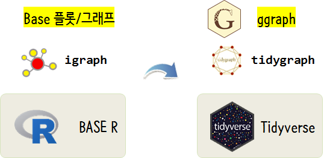

 
``` {r, include=FALSE}
source("tools/chunk-options.R")
knitr::opts_chunk$set(echo = TRUE, warning=FALSE, message=FALSE)
```

# 1. 네트워크에도 깔끔한 세상이... {#tidygraph-ggraph} 

네크워크 데이터에도 깔끔한 세상 바람이 불기 시작했고, 많은 분들이 동참하기 시작했습니다.
[tidygraph](https://github.com/thomasp85/tidygraph)와 [ggraph](https://github.com/thomasp85/ggraph)가 그 주인공입니다.

기존 Base R 체계에서 `igraph`를 기반으로 하여 Base 플롯/그래프 체제에 도전하는 경우에 따라서는 대체할 수 있는 강력한 
네트워크 데이터 분석 및 시각화 도구가 출현한 것입니다. 



# 2. 미디어 데이터 {#tidygraph-ggraph-media} 

[Katya Ognyanova](http://kateto.net/) 교수가 Github에 네트워크 데이터 강의목적으로 공개한 데이터를 가져와서 
`tidygraph`와 `ggraph` 체계에 맞춰 분석해보자.

``` {r media-data}
library(tidygraph)
library(ggraph)
library(tidyverse)
library(navdata)
library(DT)
library(igraph)
library(tidyverse)
library(extrafont)
loadfonts()

# 1. 데이터 가져오기 ------
## 1.1. CSV 데이터 가져오기 -----
nodes <- read_csv("https://raw.githubusercontent.com/kateto/R-Network-Visualization-Workshop/master/Data/Dataset1-Media-Example-NODES.csv", col_names = TRUE)
links <- read_csv("https://raw.githubusercontent.com/kateto/R-Network-Visualization-Workshop/master/Data/Dataset1-Media-Example-EDGES.csv", col_names = TRUE)
```

## 2.1. 노드 결점과 연결선 엣지 원 데이터 {#tidygraph-ggraph-media-rawdata} 

노드 결점과 연결선 엣지 원 데이터(raw data)는 다음과 같다. 원데이터를 바탕으로 네트워크 분석을 수행해도 되지만 
속도 등 다른 사항을 고려하면 노드 결점과 연결선 엣지 원 데이터를 숫자로 변환하는 것이 바람직하다.

<div class = "row">
  <div class = "col-md-6">
**노드 결점 데이터**
``` {r media-data-show-node, fig.width=6}
nodes %>% select(1:4) %>% DT::datatable()
```
  </div>
  <div class = "col-md-6">
**연결선 엣지 데이터**
``` {r media-data-show-link, fig.width=6}
DT::datatable(links)
```
  </div>
</div>


## 2.2. 결점과 연결선 데이터 정제 {#tidygraph-ggraph-media-clean} 

결점(노드)을 만드는데 `links`에서 `from`, `to`에서 모든 노드를 추출한 후에 이를 하나의 결점(노드)로 생성시킨다.
이 과정에서 문자로 되어있는 것을 숫자로 변환시킨다.
동일한 방식으로 연결선도 문자로 되어있는 것을 숫자로 변환시킨다.
그리고 나서, `tidygraph` 팩키지 `tbl_graph()` 함수를 사용해서 깔끔한 네트워크 데이터(tidygraph tibble)를 만들어낸다.

``` {r tidygraph-ggraph-media-clean}
## 1.2. 네트워크 데이터 정제: 결점 -----
### 네트워크에서 출발점 결점 추출
source_df <- links %>% 
  distinct(from) %>% 
  rename(label = from)

### 네트워크에서 도착점 결점 추출
destination_df <- links %>% 
  distinct(to) %>% 
  rename(label = to)

### 순수한 결점(노드) 정제
media_node <- full_join(source_df, destination_df, by = "label")

media_node <- media_node %>%
  mutate(id = 1:nrow(media_node)) %>%
  select(id, everything()) %>% 
  left_join(nodes, by=c("label" = "id"))

## 1.3. 네트워크 데이터 정제: 연결선 -----
### 연결선을 결점과 연결
media_edge <- links %>%
  left_join(media_node, by = c("from" = "label")) %>%
  select(-from) %>% 
  rename(from = id)

media_edge <- media_edge %>%
  left_join(media_node, by = c("to" = "label")) %>%
  select(-to) %>% 
  rename(to = id)

media_edge <- media_edge %>% 
  select(from, to, weight, type)

## 1.4. 네트워크 데이터 변환(tidygraph) -----
media_tidy_nw <- tbl_graph(
  nodes = media_node, edges = media_edge, directed = TRUE
)
```

<div class = "row">
  <div class = "col-md-6">
**노드 결점 데이터(숫자)**
``` {r media-data-show-node-num, fig.width=6}
media_node %>% select(1:4) %>% DT::datatable()
```
  </div>
  <div class = "col-md-6">
**연결선 엣지 데이터(숫자)**
``` {r media-data-show-link-num, fig.width=6}
media_edge %>% select(1:4) %>% DT::datatable()
```
  </div>
</div>


# 3. 네트워크 시각화 {#tidygraph-ggraph-media-viz} 

`tidygraph` 팩키지를 통해 네트워크 데이터를 생성했다면 다음 단계로 `ggraph` 팩키지를 통해 `ggplot`과 동일한 방식으로 
한땀 한땀 네트워크 그래프를 만들어 본다.

``` {r media-data-viz}
# 2. 데이터 시각화 -----

ggraph(media_tidy_nw, layout = "graphopt") +
  geom_node_point(aes(size = audience.size)) +
  geom_edge_link(aes(width = weight, colour = type), alpha = 0.8) +
  scale_edge_width(range = c(0.2, 2)) +
  geom_node_text(aes(label = media), repel = TRUE) +
  labs(edge_width = "media_edge") +
  theme_graph(base_family="NanumGothic") +
  facet_graph(~type.label)
```


