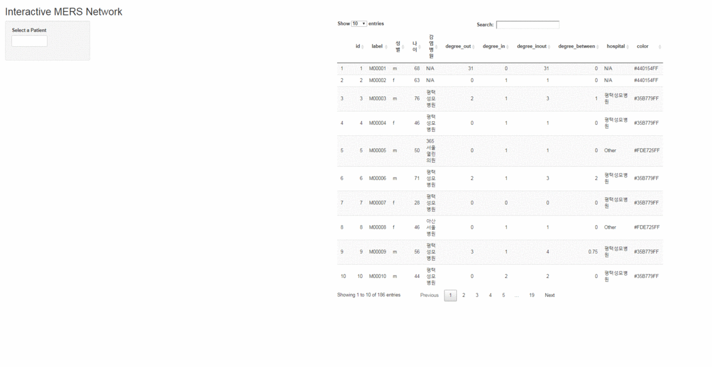
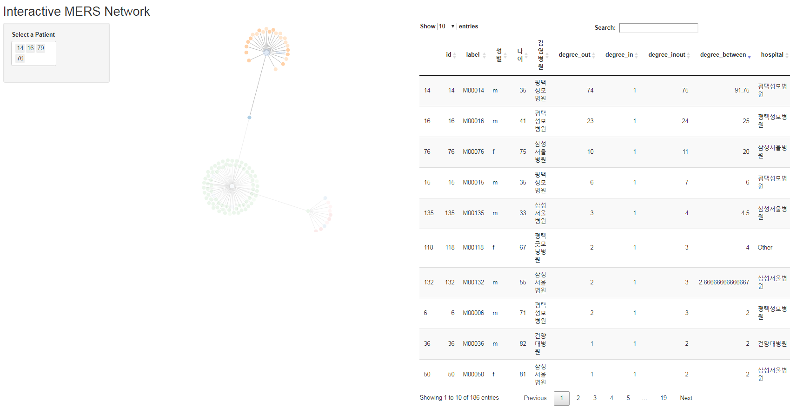

 
``` {r, include=FALSE}
source("tools/chunk-options.R")
knitr::opts_chunk$set(echo = TRUE, warning=FALSE, message=FALSE, fig.width=12, fig.height=12)

library(igraph)
library(tidyverse)
library(threejs)
library(readxl)
library(ggpubr)
library(forcats)
library(extrafont)
loadfonts()

```

## 1. 메르스 사태 네트워크 분석 [^mers-kbs] [^tidygraph-igraph] [^tidygraph] {#mers-news}

[^mers-kbs]: [데이터저널리즘, 메르스 사태를 한눈에_KBS 성재호 기자](http://reportplus.kr/?p=15034)

[^tidygraph-igraph]: [Introduction to Network Analysis with R, Creating static and interactive network graphs](https://www.jessesadler.com/post/network-analysis-with-r/)

[^tidygraph]: [Introducing tidygraph, R TIDYGRAPH NETWORK GRAPH](https://www.data-imaginist.com/2017/introducing-tidygraph/)


[메르스, 중동호흡기증후군](https://ko.wikipedia.org/wiki/%EC%A4%91%EB%8F%99%ED%98%B8%ED%9D%A1%EA%B8%B0%EC%A6%9D%ED%9B%84%EA%B5%B0)은 
2015년 5월 21일 사우디아라비아 등을 거쳐 바레인을 방문한 68세 남성이 첫 확진 진단은 이후 크나큰 사회문제와 함께 향후 숙제를 남겨주었다.

[NetMiner - MERS-CoV](http://www.netminer.com/community/event/event-readList.do) 웹사이트에 일자별로 데이터가 잘 정리되어 있다.
국문과 영문으로 두가지 언어로 제공되고 있으며 엑셀 파일을 메르스 네트워크 분석 데이터로 활용한다.

2017년 xwMOOC에서 수행한 [메르스 감염 네트워크](ml-mers-infection.html) 분석도 도움이 될 수 있다.
사실 본 분석은 2017년 네트워크 분석을 기반으로 하여 `tidygraph` 내용을 반영한 것이다.

## 2. 네트워크 분석 환경설정 {#mers-network-configuration}

[NetMiner - MERS-CoV](http://www.netminer.com/community/event/event-readList.do)에서 다운로드 받은 엑셀 파일에서 필요한 결점(Vertex, Node), 연결점(Edge, Link) 쉬트를 
`read_excel` 함수를 통해 불러온다.

- 결점(Vertex): (한국어)2015-10-02xlsx.xlsx", sheet="확진자"
- 연결선(Edge): (한국어)2015-10-02xlsx.xlsx", sheet="확진자간 link"

그리고 나서 `tbl_graph()` 함수를 통해 `tidygraph` 네트워크 객체를 생성하면 데이터 준비는 모두 끝났다.

``` {r mers-network-pkg}
# 0. 환경설정 ------------------
library(igraph)
library(tidyverse)
library(tidygraph)
library(ggraph)
library(threejs)
library(readxl)
library(crosstalk)
library(extrafont)
loadfonts()
library(viridisLite)

# 1. 데이터 가져오기 ------
## 1.1. 결점 노드
mers_info <- read_excel("data/(한국어)2015-10-02xlsx.xlsx", sheet="확진자")
colnames(mers_info) <-c("확진자", "성별", "나이", "확진일", "현상태", "현상태_판정일자", 
                        "감염병원", "감염지역", "감염 이유", "비고")

mers_vert <- mers_info %>%
  mutate(병원색상 = as.numeric(fct_lump(감염병원, 3))) %>% 
  mutate(id = 1:nrow(mers_info)) %>% 
  rename(label = 확진자) %>% 
  select(id, label)

## 1.2. 연결선 엣지
mers_edge <- read_excel("data/(한국어)2015-10-02xlsx.xlsx", sheet="확진자간 link") %>% 
  select(SOURCE, TARGET)

### 연결선을 결점과 연결
mers_edge <- mers_edge %>%
  left_join(mers_vert, by = c("SOURCE" = "label")) %>%
  select(-SOURCE) %>% 
  rename(from = id)

mers_edge <- mers_edge %>%
  left_join(mers_vert, by = c("TARGET" = "label")) %>%
  select(-TARGET) %>% 
  rename(to = id)

## 1.3. 결점 노드 & 연결선 추가정보
mers_vert <- left_join(mers_vert, mers_info, by=c("label" =  "확진자")) %>% 
  select(id, label, 성별, 나이, 감염병원)

## 1.4. 네트워크 데이터 변환
mers_tidy_nw <- tbl_graph(
  nodes = mers_vert, edges = mers_edge, directed = TRUE
)

mers_tidy_nw
```

## 3. 네트워크 분석 시각화 {#mers-network-viz}

`ggraph()` 함수를 통해 `tidygraph` 객체를 `ggplot` 방식으로 쉽게 네트워크 그래프를 생성시킬 수 있다.

``` {r mers-network-ggraph}
# 2. 데이터 시각화 ------
ggraph(mers_tidy_nw, layout = "graphopt") +
  geom_node_point(aes(colour = 성별)) +
  geom_edge_link() +
  scale_edge_width(range = c(0.2, 2)) +
  geom_node_text(aes(label = label), repel = TRUE) +
  theme_graph(base_family="NanumGothic")
```

## 4. 네트워크 기술 통계 {#mers-network-desc-stat}

`tidygraph` 객체를 `activate()` 함수로 다양한 네트워크 기술 통계량을 쉽게 도출할 수 있다.
`centrality_degree()`, `centrality_betweenness()` 함수로 간단히 연결중심성(Degree centrality), 매개중심성 (Betweenness centrality)을 산출하여
후속 분석에 파이프 연산자로 사용이 가능하다.

``` {r mers-network-descriptive}
# 3. 네트워크 기술통계 ------
## 3.1. 기술통계량 -----
mers_tidy_nw <- mers_tidy_nw %>% 
  activate(nodes) %>% 
  mutate(degree_out = centrality_degree(mode="out"),
         degree_in = centrality_degree(mode="in"),
         degree_inout = centrality_degree(mode="all"),
         degree_between = centrality_betweenness()) %>% 
  mutate(hospital = as.factor(감염병원)) %>% 
  mutate(hospital = fct_lump(hospital, 6)) %>% 
  mutate(color = case_when(str_detect(hospital, "N/A")   ~ viridis(7)[1],
                           str_detect(hospital, "건양")  ~ viridis(7)[2],
                           str_detect(hospital, "대청")  ~ viridis(7)[3],
                           str_detect(hospital, "삼성")  ~ viridis(7)[4],
                           str_detect(hospital, "평택")  ~ viridis(7)[5],
                           str_detect(hospital, "한림")  ~ viridis(7)[6],
                           str_detect(hospital, "Other") ~ viridis(7)[7]))

## 3.2. tidy 네트워크를 데이터프레임으로 변환 -----
mers_tidy_df <- mers_tidy_nw %>% 
  activate(nodes) %>% 
  as_tibble

DT::datatable(mers_tidy_df)
```

## 5. `crosstalk` 인터랙티브 {#mers-network-crosstalk}

`crosstalk`를 활용하여 `threejs` 팩키지 `graphjs()` 함수로 인터랙티브 데이터 시각화가 가능하다.

``` {r mers-network-crosstalk}
# 4. crosstalk 시각화 ------
sd  <- SharedData$new(mers_tidy_df)

bscols(
  widths = c(6, 6),
  graphjs(mers_tidy_nw,
          vertex.color = V(mers_tidy_nw)$color,
          vertex.frame.color = 'white',
          vertex.shape = 'circle',
          vertex.size = V(mers_tidy_nw)$degree_out/25,
          vertex.label = V(mers_tidy_nw)$label, 
          vertex.label.color = "gray20",
          vertex.label.family = 'NanumGothic',
          vertex.label.font = 0.5,
          vertex.label.cex = 0.7,
          edge.color = "gray50",
          edge.width = 0.8,
          edge.lty = 1,
          edge.curved = 0.3,
          edge.arrow.size = .2,
          margin = c(0,0,0,0),
          brush=TRUE, 
          crosstalk=sd,
          main = ""),
  DT::datatable(sd, rownames=FALSE)
)
```


## 6. `shiny` 메르스 네트워크 - 정적 그래프 {#mers-network-shiny-static}

`shiny` 팩키지를 활용하여 메르스 네트워크에 대한 인터랙티브 분석을 시도해본다.
환자 ID를 선택하여 네트워크를 연결시켜 본다.

`global.R` 파일에 엑셀 원본데이터를 불러와서 이를 `tidygraph` 네트워크 객체로 변환시키고,
네트워크 기술통계량을 결점 노드 데이터프레임으로 저장시킨다.

``` {r shiny-mers-global, eval=FALSE}
# 0. 환경설정 -----
library(tidyverse)
library(lubridate)
library(ggthemes)
library(extrafont)
loadfonts()
library(igraph)
library(DT)
library(tidygraph)
library(ggraph)
library(readxl)
library(viridisLite)

# 1. 데이터 가져오기 -----
## 1.1. 결점 노드
mers_info <- read_excel("data/(한국어)2015-10-02xlsx.xlsx", sheet="확진자")
colnames(mers_info) <-c("확진자", "성별", "나이", "확진일", "현상태", "현상태_판정일자", 
                        "감염병원", "감염지역", "감염 이유", "비고")

mers_vert <- mers_info %>%
  mutate(병원색상 = as.numeric(fct_lump(감염병원, 3))) %>% 
  mutate(id = 1:nrow(mers_info)) %>% 
  rename(label = 확진자) %>% 
  select(id, label)

## 1.2. 연결선 엣지
mers_edge <- read_excel("data/(한국어)2015-10-02xlsx.xlsx", sheet="확진자간 link") %>% 
  select(SOURCE, TARGET)

### 연결선을 결점과 연결
mers_edge <- mers_edge %>%
  left_join(mers_vert, by = c("SOURCE" = "label")) %>%
  select(-SOURCE) %>% 
  rename(from = id)

mers_edge <- mers_edge %>%
  left_join(mers_vert, by = c("TARGET" = "label")) %>%
  select(-TARGET) %>% 
  rename(to = id)

## 1.3. 결점 노드 & 연결선 추가정보
mers_vert <- left_join(mers_vert, mers_info, by=c("label" =  "확진자")) %>% 
  select(id, label, 성별, 나이, 감염병원)

## 1.4. 네트워크 데이터 변환
mers_tidy_nw <- tbl_graph(
  nodes = mers_vert, edges = mers_edge, directed = TRUE
)

# 2. 네트워크 기술통계 ------
## 2.1. 기술통계량 -----
mers_tidy_nw <- mers_tidy_nw %>% 
  activate(nodes) %>% 
  mutate(degree_out = centrality_degree(mode="out"),
         degree_in = centrality_degree(mode="in"),
         degree_inout = centrality_degree(mode="all"),
         degree_between = centrality_betweenness()) %>% 
  mutate(hospital = as.factor(감염병원)) %>% 
  mutate(hospital = fct_lump(hospital, 6)) %>% 
  mutate(color = case_when(str_detect(hospital, "N/A")   ~ viridis(7)[1],
                           str_detect(hospital, "건양")  ~ viridis(7)[2],
                           str_detect(hospital, "대청")  ~ viridis(7)[3],
                           str_detect(hospital, "삼성")  ~ viridis(7)[4],
                           str_detect(hospital, "평택")  ~ viridis(7)[5],
                           str_detect(hospital, "한림")  ~ viridis(7)[6],
                           str_detect(hospital, "Other") ~ viridis(7)[7]))

## 2.2. tidy 네트워크를 데이터프레임으로 변환 -----
mers_tidy_df <- mers_tidy_nw %>% 
  activate(nodes) %>% 
  as_tibble
```

`ui.R`, `server.R`에 환자 ID를 선택하면 자동으로 네트워크 그래프를 생성시키도록 코딩을 한다.


<div class = "row">
  <div class = "col-md-6">
**`ui.R`**

``` {r mers-network-shiny-ui, eval=FALSE}
shinyUI(fluidPage(
  
  titlePanel("Interactive MERS Network"),
  
  sidebarLayout(
    div(style="width: 40%;",
      sidebarPanel(
        selectInput("node", "Select a Patient", choices = unique(V(mers_tidy_nw)$id), multiple=TRUE, width = "50%")
      )
    ),
    
    mainPanel(
      column(width=6,
        plotOutput("network_plot", width=800, height=800)
      ),
      column(width=6,
        DT::dataTableOutput("mers_table")
      )
    )
  )
))

```
  </div>
  <div class = "col-md-6">
**`server.R`**

``` {r mers-network-shiny-server, eval=FALSE}
shinyServer(function(input, output) {
  
  mers_subgraph <- reactive({
    # 특정 결점기준 시각화 -----
    req(input$node)
    edges <- E(mers_tidy_nw)[input$node%--%V(mers_tidy_nw)]

    mers_subgraph <- subgraph.edges(graph = mers_tidy_nw, eids = edges) %>%
      simplify(remove.multiple = TRUE, remove.loops = TRUE)

  })
  
  output$network_plot <- renderPlot({
    
    # 2. 데이터 시각화 ------
    ggraph(mers_subgraph(), layout = "graphopt") +
      geom_node_point(aes(colour = 성별)) +
      geom_edge_link() +
      scale_edge_width(range = c(0.2, 2)) +
      geom_node_text(aes(label = label), repel = TRUE) +
      theme_graph(base_family="NanumGothic")
    
  })
  
  output$mers_table <- DT::renderDataTable({

    mers_tidy_df %>%
      datatable()
  })
})

```

  </div>
</div>





## 7. `shiny` 메르스 네트워크 - 동적 그래프 {#mers-network-shiny-dynamic}

앞선 `gggraph()` 정적 그래프를 동적 네트워크 그래프로 구현한다.
`networkD3`를 사용하는데 인덱스가 0부터 시작하여 이를 반영하는 로직을 추가한다.


``` {r shiny-mers-global-networkD3, eval=FALSE}
# 0. 환경설정 -----
library(tidyverse)
library(lubridate)
library(ggthemes)
library(extrafont)
loadfonts()
library(igraph)
library(DT)
library(tidygraph)
library(ggraph)
library(readxl)
library(viridisLite)
library(networkD3)

# 1. 데이터 가져오기 -----
## 1.1. 결점 노드
mers_info <- read_excel("data/(한국어)2015-10-02xlsx.xlsx", sheet="확진자")
colnames(mers_info) <-c("확진자", "성별", "나이", "확진일", "현상태", "현상태_판정일자", 
                        "감염병원", "감염지역", "감염 이유", "비고")

mers_vert <- mers_info %>%
  mutate(병원색상 = as.numeric(fct_lump(감염병원, 3))) %>% 
  mutate(id = 1:nrow(mers_info)) %>% 
  rename(label = 확진자) %>% 
  select(id, label)

## 1.2. 연결선 엣지
mers_edge <- read_excel("data/(한국어)2015-10-02xlsx.xlsx", sheet="확진자간 link") %>% 
  select(SOURCE, TARGET)

### 연결선을 결점과 연결
mers_edge <- mers_edge %>%
  left_join(mers_vert, by = c("SOURCE" = "label")) %>%
  select(-SOURCE) %>% 
  rename(from = id)

mers_edge <- mers_edge %>%
  left_join(mers_vert, by = c("TARGET" = "label")) %>%
  select(-TARGET) %>% 
  rename(to = id)

## 1.3. 결점 노드 & 연결선 추가정보
mers_vert <- left_join(mers_vert, mers_info, by=c("label" =  "확진자")) %>% 
  select(id, label, 성별, 나이, 감염병원)

## 1.4. 네트워크 데이터 변환
mers_tidy_nw <- tbl_graph(
  nodes = mers_vert, edges = mers_edge, directed = TRUE
)

# 2. 네트워크 기술통계 ------
## 2.1. 기술통계량 -----
mers_tidy_nw <- mers_tidy_nw %>% 
  activate(nodes) %>% 
  mutate(degree_out = centrality_degree(mode="out"),
         degree_in = centrality_degree(mode="in"),
         degree_inout = centrality_degree(mode="all"),
         degree_between = centrality_betweenness()) %>% 
  mutate(hospital = as.factor(감염병원)) %>% 
  mutate(hospital = fct_lump(hospital, 6)) %>% 
  mutate(color = case_when(str_detect(hospital, "N/A")   ~ viridis(7)[1],
                           str_detect(hospital, "건양")  ~ viridis(7)[2],
                           str_detect(hospital, "대청")  ~ viridis(7)[3],
                           str_detect(hospital, "삼성")  ~ viridis(7)[4],
                           str_detect(hospital, "평택")  ~ viridis(7)[5],
                           str_detect(hospital, "한림")  ~ viridis(7)[6],
                           str_detect(hospital, "Other") ~ viridis(7)[7]))

## 2.2. tidy 네트워크를 데이터프레임으로 변환 -----
mers_tidy_df <- mers_tidy_nw %>% 
  activate(nodes) %>% 
  as_tibble
```

`ui.R`, `server.R`에 환자 ID를 선택하면 자동으로 네트워크 그래프를 생성시키도록 코딩을 한다.


<div class = "row">
  <div class = "col-md-6">
**`ui.R`**

``` {r mers-network-shiny-ui-networkD3, eval=FALSE}
shinyUI(fluidPage(
  
  titlePanel("Interactive MERS Network"),
  
  sidebarLayout(
    div(style="width: 40%;",
      sidebarPanel(
        selectInput("node", "Select a Patient", choices = unique(V(mers_tidy_nw)$id), multiple=TRUE, width = "50%")
      )
    ),
    
    mainPanel(
      column(width=6,
        forceNetworkOutput("network_plot")
      ),
      column(width=6,
        DT::dataTableOutput("mers_table")
      )
    )
  )
))

```
  </div>
  <div class = "col-md-6">
**`server.R`**

``` {r mers-network-shiny-server-networkD3, eval=FALSE}
shinyServer(function(input, output) {

  mers_subgraph <- reactive({
    # 특정 결점기준 시각화 -----
    req(input$node)
    edges <- E(mers_tidy_nw)[input$node%--%V(mers_tidy_nw)]

    mers_subgraph <- subgraph.edges(graph = mers_tidy_nw, eids = edges) %>%
      simplify(remove.multiple = TRUE, remove.loops = TRUE)

  })
  
  output$network_plot <- renderForceNetwork({

    mers_tidy_subgraph <- as_tbl_graph(mers_subgraph())
    
    # 1 인덱스를 0 인덱스로 변환
    mers_networkD3_vert_df <-  mers_tidy_subgraph %>% 
      activate(nodes) %>% 
      as_tibble %>% 
      mutate(id = id -1L)
    
    mers_networkD3_edge_df <- mers_tidy_subgraph %>% 
      activate(edges) %>% 
      mutate(value = 1) %>% 
      as_tibble %>% 
      mutate(from = from - 1L,
             to = to -1L)
    
    forceNetwork(Links = mers_networkD3_edge_df, Nodes = mers_networkD3_vert_df, 
                 Source = "from", Target = "to", NodeID = "label",
                 Group = "감염병원", zoom = TRUE)
    
  })
  
  output$mers_table <- DT::renderDataTable({

    mers_tidy_df %>%
      datatable()
  })
})

```

  </div>
</div>

